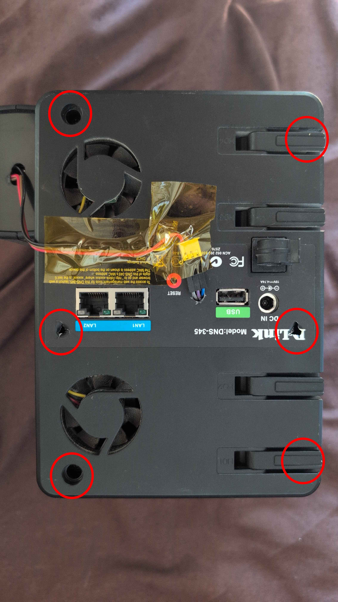
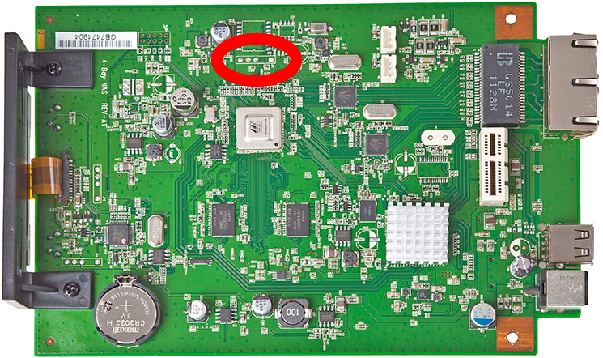
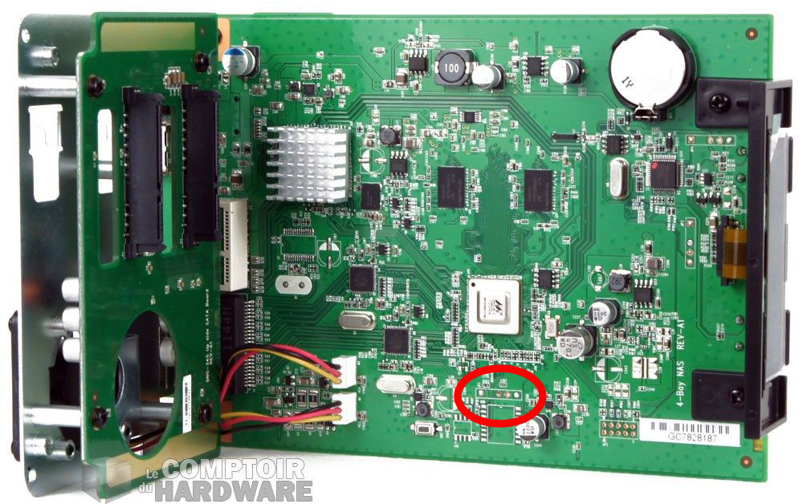
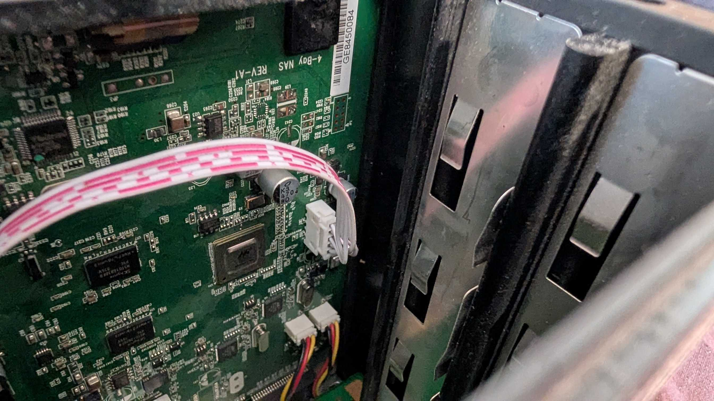
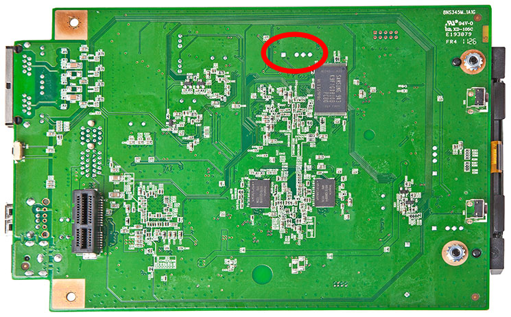

# D-Link DNS-345 — Debian Bookworm on a 2009 NAS

Run **Debian 12 (Bookworm)** with a modern kernel, SMB2/3, and SSH on a D-Link DNS-345 4-bay NAS.

This guide covers the complete process, including the solution to the undocumented `enaAutoRecovery` mechanism that prevents any boot customization, and a full brick recovery procedure using kwboot.

## Table of Contents

- [Why?](#why)
- [Hardware](#hardware)
- [Prerequisites](#prerequisites)
- [Architecture](#architecture)
- [Key Discoveries](#key-discoveries)
- [Mini-Tutorial: Your First Serial Connection](#mini-tutorial-your-first-serial-connection)
- [Step-by-Step Installation](#step-by-step-installation)
  - [Phase 1: Connect Serial Console](#phase-1-connect-serial-console)
  - [Phase 2: Get Shell Access](#phase-2-get-shell-access)
  - [Phase 3: Backup NAND](#phase-3-backup-nand-critical)
  - [Phase 4: Build Kernel Image](#phase-4-build-kernel-image-host-pc)
  - [Phase 5: Set Up TFTP Server](#phase-5-set-up-tftp-server-host-pc)
  - [Phase 6: Prepare Debian Rootfs](#phase-6-prepare-debian-rootfs)
  - [Phase 7: Flash Kernel to NAND](#phase-7-flash-kernel-to-nand)
  - [Phase 8: First Boot into Debian](#phase-8-first-boot-into-debian)
  - [Phase 9: Post-Installation](#phase-9-post-installation)
  - [Phase 10: Automatic Boot](#phase-10-automatic-boot-patch-u-boot)
  - [Phase 11: RAID 5](#phase-11-raid-5-optional)
  - [Phase 12: Samba SMB2/3](#phase-12-samba-smb23)
  - [Phase 13: Security Hardening](#phase-13-security-hardening)
  - [Phase 14: NFS Server](#phase-14-nfs-server)
  - [Phase 15: Web Dashboard](#phase-15-web-dashboard)
  - [Phase 16: Temperature-Based Fan Control](#phase-16-temperature-based-fan-control)
- [Brick Recovery](#brick-recovery)
- [U-Boot Binary Reference](#u-boot-binary-reference)
- [Troubleshooting](#troubleshooting)
- [Future Work](#future-work)
- [Repository Files](#repository-files)
- [Credits](#credits)

## Why?

The DNS-345 ships with software from 2009:

| Component | Stock Version | Problem |
|-----------|--------------|---------|
| Kernel | 2.6.31 | No security updates since 2012 |
| Samba | 3.5.15 | SMB1 only — blocked by Windows 10+, macOS |
| OpenSSH | 5.0p1 | Deprecated algorithms, modern clients can't connect |
| glibc | 2.8 | Can't run any modern software |

After this guide, you'll have:
- **Kernel 6.5.7** with security updates
- **Samba 4.17** with SMB2/SMB3 (works with all modern clients)
- **NFSv4 server** sharing the same data tree as Samba
- **OpenSSH 9.2** with modern algorithms
- **Debian 12** with `apt` package manager
- **RAID 5** with 4 disks (~2.7TB usable)
- **Web dashboard** (port 8080) showing temps, RAID, SMART, services
- **Automatic fan control** — varies speed based on board temperature instead of running at max
- **Automatic boot** — no manual intervention needed

## Hardware

| Component | Details |
|-----------|---------|
| **NAS** | D-Link DNS-345, 4-bay |
| **SoC** | Marvell Kirkwood 88F6282 (Feroceon 88FR131, ARMv5TE) |
| **CPU** | 1.6 GHz single-core ARM |
| **RAM** | 512 MB DDR3 |
| **NAND** | 128 MB (Hynix, 128KB erase blocks, 2048-byte pages) |
| **SATA** | Marvell 88SX7042 PCI-Express (4 ports) |
| **Ethernet** | 2x Gigabit (Marvell mv643xx) |
| **UART** | JP1, 5-position 2.54 mm header, pin 2 removed as a key; VCC on position 3, 115200 8N1, 3.3V TTL |
| **I2C** | LM75 temperature sensor at 0x48 |

## Prerequisites

**Hardware you need:**
- USB-TTL serial adapter (3.3V, e.g. CH340, CP2102, FT232RL)
- 3 female-to-female jumper wires, 2.54 mm / 0.1" (the ordinary "Dupont" kind — TX, RX, GND)
- A computer on the same LAN (Linux, macOS, or Windows with WSL)

**Software you need on the host PC:**
- `picocom` or `minicom` — serial terminal
- `mkimage` (from u-boot-tools) — create kernel images
- `python3` — TFTP server
- `kwboot` (from u-boot-tools) — UART boot recovery (optional, needed only if bricked)

**On NixOS:**
```nix
environment.systemPackages = with pkgs; [ picocom ubootTools python3 ];
networking.firewall.allowedUDPPorts = [ 69 ]; # TFTP
```

**On Debian/Ubuntu:**
```bash
sudo apt install picocom u-boot-tools python3
```

## Architecture

### Boot Flow

```
Power On
  │
  ▼
┌──────────────────────────────────────────────────┐
│ Kirkwood Boot ROM                                │
│  ├── Check NAND block 0 header                   │
│  │   └── Valid? → Load U-Boot from NAND          │
│  └── No valid header? → UART boot mode (kwboot)  │
└──────────────────────────────────────────────────┘
  │
  ▼
┌──────────────────────────────────────────────────┐
│ U-Boot 1.1.4 (Marvell 3.5.9)                    │
│  ├── Read environment from NAND                  │
│  ├── enaAutoRecovery=yes ?                       │
│  │   ├── No  → Normal boot, bootdelay=3          │
│  │   └── Yes → Reset env, bootdelay=0            │
│  │            └── Run HARDCODED recovery bootcmd  │
│  │                                               │
│  │   ┌── STOCK recovery bootcmd ──────────────┐  │
│  │   │ Read D-Link image from mtd3 → bootm    │  │
│  │   │ If fail → read mini firmware from mtd4  │  │
│  │   │ If fail → drop to U-Boot prompt         │  │
│  │   └────────────────────────────────────────┘  │
│  │                                               │
│  │   ┌── PATCHED recovery bootcmd ────────────┐  │
│  │   │ Read Debian kernel from mtd1 → bootm   │  │
│  │   │ Boots Debian automatically ✓            │  │
│  │   └────────────────────────────────────────┘  │
└──────────────────────────────────────────────────┘
  │
  ▼
┌──────────────────────────────────────────────────┐
│ Linux 6.5.7 (Debian Bookworm)                    │
│  └── root=/dev/sda1 (SATA disk 1, partition 1)   │
└──────────────────────────────────────────────────┘
```

### NAND Layout (128 MB)

| Partition | MTD | Offset | Size | Contents |
|-----------|-----|--------|------|----------|
| U-Boot | mtd0 | 0x000000 | 1 MB | Bootloader (**do not touch** until Phase 10) |
| uImage | mtd1 | 0x100000 | 5 MB | Debian kernel (start) |
| ramdisk | mtd2 | 0x600000 | 5 MB | Debian kernel (end, ~1.2 MB used) |
| image | mtd3 | 0xB00000 | 102 MB | D-Link firmware (erased in Phase 7) |
| mini firmware | mtd4 | 0x7100000 | 10 MB | D-Link recovery (erased in Phase 7) |
| config | mtd5 | 0x7B00000 | 5 MB | D-Link config (unused) |

### Disk Layout

```
Disk      Partitions         Purpose
────      ──────────         ───────
sda       sda1 (4 GB)        Debian rootfs (ext3, mounted /)
          sda2 (rest)        RAID 5 member
sdb       sdb1 (full)        RAID 5 member
sdc       sdc1 (full)        RAID 5 member
sdd       sdd1 (full)        RAID 5 member

md0       RAID 5 (2.7 TB)    Data volume (ext4, mounted /srv/data)
```

If you add the optional USB backup rootfs (below), it appears as a further device — but do not assume which letter.

> **Note:** Device names may change between boots — see [Key Discovery #4](#4-disk-ordering-changes-with-new-kernel). Identify devices with `lsblk`, and **never hardcode `/dev/sdX` in a config file**. Under the 2.6.31 stock kernel the fourth RAID member enumerated as `sde`; under 6.5.7 it is `sdd`. A leftover `/dev/sde` line in `/etc/smartd.conf` is what silently kept SMART monitoring from ever starting on this build.

---

## Key Discoveries

These issues are **not documented anywhere** and were discovered the hard way. Each one can waste hours if you're not aware of it.

### 1. Wrong DTB — PCI-E SATA Not Detected

The DNS-345 uses a **PCI-Express SATA controller** (Marvell 88SX7042), NOT the Kirkwood integrated SATA. The obvious DTB choice `kirkwood-dns325.dtb` has PCI-E **disabled** — no disks are detected.

**Fix:** Use `kirkwood-ts419-6282.dtb` (QNAP TS-419) which has PCI-E enabled. Same 88F6282 SoC, and PCI-E SATA works perfectly.

### 2. Kernel Too Big for NAND Partition

The uImage with DTB is ~6.2 MB. The default `bootcmd` reads only 3 MB from mtd1 (5 MB partition). The kernel CRC check fails.

**Fix:** Read 6 MB spanning both mtd1 and mtd2: `nand read.e 0x800000 0x100000 0x600000`

### 3. enaAutoRecovery Defeats All Boot Customization

This is the biggest obstacle. The D-Link U-Boot has `enaAutoRecovery=yes` which:
- Resets **all** environment variables (your `saveenv` changes are lost)
- Forces `bootdelay=0` (no time to press a key)
- Runs a **hardcoded** recovery boot command from the binary itself (not from the environment)

`saveenv`, `fw_setenv`, patching the compiled-in default environment — **none of these work**. The recovery bootcmd is hardcoded in the U-Boot binary at offset `0x4FAAD`.

**Fix:** Patch the binary. The included `scripts/patch_uboot.py` replaces the hardcoded recovery bootcmd with one that boots Debian. See [Phase 10](#phase-10-automatic-boot-patch-u-boot).

### 4. Disk Ordering Changes with New Kernel

The old kernel (2.6.31) and the new kernel (6.5.7) detect disks in a different order. The disk that was `sda` under the old kernel might be `sdc` under the new one.

**Fix:** Use UUIDs in fstab and bootargs, or identify disks by size/serial with `lsblk`.

### 5. No Serial Download in U-Boot

This U-Boot has **no** `loady`, `loadb`, or `loadx` commands. You cannot transfer files over the serial console. The only way to transfer files to U-Boot is **TFTP over Ethernet**.

---

## Mini-Tutorial: Your First Serial Connection

**For readers with no electronics background.** This gets you from "a NAS and a screwdriver" to "text from the NAS appearing on my screen" in about twenty minutes. Nothing is soldered, nothing is irreversible, and every step tells you what you should see before moving on. Once you reach the end, the rest of this guide starts at [Phase 2](#phase-2-get-shell-access).

> *What are we doing?* Before any operating system runs, the NAS's boot loader talks over a tiny 3-wire serial port on the main board. Plug a cheap USB adapter onto it and your PC becomes the NAS's keyboard and screen. That is the only way to install anything on this machine.

### Step 1 — Gather the parts (≈ 5 €)

| Part | What to search for | Notes |
|---|---|---|
| USB-to-TTL serial adapter | *"CH340 USB TTL 3.3V"* or *"CP2102 USB TTL"* | **Must be 3.3 V.** If it has a jumper or switch for 3.3 V / 5 V, set it to 3.3 V now and never touch it again. |
| 3 female-to-female jumper wires | *"Dupont jumper wires female female"* | 2.54 mm / 0.1" — the ordinary kind. That is exactly the pitch of the NAS connector. |
| Small Phillips screwdriver | — | For the six case screws. |

Do **not** buy anything labelled RS-232, DB9, or "serial cable" for PCs — that is a different, higher-voltage standard and will destroy the port.

### Step 2 — Prepare the PC

Install a serial terminal program (see [Prerequisites](#prerequisites) for the exact command on your system; on Debian/Ubuntu it is `sudo apt install picocom`).

Plug the USB adapter into the PC **with nothing wired to it yet**, then:

```bash
ls /dev/ttyUSB*
```

✅ **You should see** `/dev/ttyUSB0` (the number may differ — note it, you will type it in Step 7). If nothing appears, try another USB port or cable.

On Linux your user needs permission to use it. Do this once, then log out and back in:

```bash
sudo usermod -aG dialout "$USER"
```

### Step 3 — Open the case

**Unplug the NAS power cable.** Six screws hold the back panel; they are circled below. Two of them hide behind the HD1 and HD4 drive-tray latches, so slide those two trays out first. There are no screws under stickers or rubber feet.



*(Photographed with the unit on its top, so the printed labels read upside down. The screw positions are what matter.)*

✅ **You should see** the green main board once the panel comes away. You do **not** need to remove the board.

### Step 4 — Find the serial connector

Look just below the large Marvell chip, next to a small cylindrical capacitor: a small white connector, labelled JP1. It has five positions but only **four pins** — the second slot is empty on purpose, so nothing can be plugged in backwards.







If you ever doubt which end is which, the underside settles it. Position 1 has a **square** solder pad — that is how board makers mark pin 1 — then a gap where position 2 would be, then three round pads:



*Top and bottom board views: Hardware Centre review, annotation added. Full-board-in-cage photo: Le Comptoir du Hardware. The cable photo and the back panel are ours.*

✅ **You should see** one lone pin on one side of the empty slot (position 1) and three pins together on the other (positions 3, 4, 5).

### Step 5 — Connect three wires

```
JP1 on DNS-345 PCB — 5 positions, 2.54 mm, pin 2 removed
┌───────────────┐
│ ■  ✕  ●  ●  ● │
│ 1  2  3  4  5 │
└───────────────┘

Pos 1: serial data (TX or RX — see below)
Pos 2: (no pin — polarizing key, nothing to connect)
Pos 3: VCC 3.3V — DO NOT CONNECT
Pos 4: serial data (TX or RX — see below)
Pos 5: GND
```

How this was read off the board: positions 1 and 4 each go through a small series resistor — the signature of a data line; position 3 has a wide trace and a decoupling capacitor right beside it — the signature of a power rail. Which of 1 and 4 is TX and which is RX has not been measured, so the wiring below is ordered so that **it does not matter**: you never drive a signal into a pin until you know what it is.

> ⚠️ **Position 3 is a 3.3 V power output. Leave it alone.** It is the *first of the three grouped pins*, the one nearest the empty slot, with the small capacitor beside it. Connecting it to the adapter can damage both devices.

**Wire in this order:**

| # | NAS position | → | Adapter pin | Why this order |
|---|---|---|---|---|
| 1 | 5 (GND) | → | **GND** | Common ground first, always. |
| 2 | 1 | → | **RX** | Listening is harmless whatever the pin is. Do Steps 6–7: if text appears, position 1 is the NAS's TX. If nothing appears, move this wire to position 4 and try again — now 4 is TX. |
| 3 | the other data pin (4 or 1) | → | **TX** | Only now, once you know which pin was TX, connect the adapter's TX to the remaining data pin — that is the NAS's RX. Typing in the terminal now works. |

Yes, the NAS's TX goes to the adapter's RX and vice versa — each side *transmits* into the other's *receive*. Doing it in this order means the only wrong move possible is "no text yet", never a damaged part.

### Step 6 — Open the terminal *before* powering on

The interesting text appears in the first two seconds after power-up, so start listening first:

```bash
picocom -b 115200 /dev/ttyUSB0      # use the device name from Step 2
```

✅ **You should see** `Terminal ready`. (To quit picocom later: press `Ctrl+A`, then `Ctrl+X`.)

### Step 7 — Power on and watch

Plug the NAS power cable back in and press the power button.

✅ **You should see**, within a couple of seconds, text like:

```
U-Boot 1.1.4 (Jun 26 2012 - 18:13:14) Marvell version: 3.5.9
...
Hit any key to stop autoboot:  0
```

That is the NAS talking to you. **You have a working serial console.** Continue with [Phase 2](#phase-2-get-shell-access) — from here on, the guide assumes exactly this setup.

### If it does not work

| Symptom | Cause | Fix |
|---|---|---|
| Nothing at all, ever | TX and RX swapped | Power off, swap the two wires, try again. Harmless. |
| Random symbols / `���` | Wrong speed | Make sure you passed `-b 115200`. |
| `Permission denied` on `/dev/ttyUSB0` | Not in the `dialout` group | Step 2's `usermod`, then log out and back in — or prefix with `sudo` for now. |
| `/dev/ttyUSB0` missing | Adapter not detected | Different USB port/cable; some adapters need a driver on macOS/Windows. |
| Text, but you can't type | Adapter TX not on the NAS's RX yet | Finish wiring step 3: adapter TX to whichever data pin (1 or 4) did *not* give you text. |
| Autoboot counts down from 0 and you can't interrupt | Normal on stock firmware (`enaAutoRecovery`) | Nothing wrong. [Phase 7](#phase-7-flash-kernel-to-nand) explains how to get a prompt anyway. |

---

## Step-by-Step Installation

### Phase 1: Connect Serial Console

The serial console is **required** for U-Boot interaction — everything from here on assumes it is working.

**Never done this? Follow the [mini-tutorial](#mini-tutorial-your-first-serial-connection) first.** It covers the shopping list, opening the case, the photos, the pinout and what you should see — with no electronics background assumed.

For reference: connector JP1 is a 5-position 2.54 mm header with pin 2 removed as a key (square pad = position 1 on the underside). Position 5 is GND, positions 1 and 4 are the data lines, **position 3 is 3.3 V and must stay unconnected**. Full diagram and the safe wiring order in [Step 5 of the tutorial](#step-5--connect-three-wires).

```bash
picocom -b 115200 /dev/ttyUSB0
# Exit picocom: Ctrl+A then Ctrl+X
```

> **Tip:** No output → swap TX and RX (harmless). Garbage characters → check the baud rate is 115200.

### Phase 2: Get Shell Access

You need shell access to the stock D-Link firmware for NAND backup and rootfs preparation.

**Option A: SSH (if already enabled)**

The stock firmware may have SSH/Telnet available. Try:
```bash
ssh root@<nas-ip>
# or
telnet <nas-ip>
```

**Option B: CVE-2024-3273 (command injection)**

The DNS-345 firmware is vulnerable to [CVE-2024-3273](https://nvd.nist.gov/vuln/detail/CVE-2024-3273), which allows unauthenticated command injection via the web management interface. This can be used to start an SSH server or obtain a reverse shell.

**Option C: Serial console**

If the NAS boots to the stock firmware, you'll see a login prompt on the serial console. The default credentials may be `root` with no password, or the admin password set in the web interface.

### Phase 3: Backup NAND (Critical!)

**Back up every NAND partition before making any changes.** This is your only way to restore the original firmware if something goes wrong.

From the stock firmware shell:
```bash
# Create backup directory on a SATA disk
mkdir -p /mnt/HD/HD_b2/nand_backup

# Dump all NAND partitions
nanddump -f /mnt/HD/HD_b2/nand_backup/mtd0_uboot.bin /dev/mtd0
nanddump -f /mnt/HD/HD_b2/nand_backup/mtd1_kernel.bin /dev/mtd1
nanddump -f /mnt/HD/HD_b2/nand_backup/mtd2_ramdisk.bin /dev/mtd2
nanddump -f /mnt/HD/HD_b2/nand_backup/mtd3_image.bin /dev/mtd3
nanddump -f /mnt/HD/HD_b2/nand_backup/mtd4_mini.bin /dev/mtd4
nanddump -f /mnt/HD/HD_b2/nand_backup/mtd5_config.bin /dev/mtd5

# Verify sizes
ls -la /mnt/HD/HD_b2/nand_backup/
# mtd0 should be ~1MB, mtd1 ~5MB, mtd2 ~5MB, etc.
```

**Copy the mtd0 dump to your host PC** — you'll need it later to build the patched U-Boot:
```bash
scp root@<nas-ip>:/mnt/HD/HD_b2/nand_backup/mtd0_uboot.bin .
```

> If `nanddump` is not available on the stock firmware, you can install it from the Debian rootfs later, or use `dd if=/dev/mtd0ro of=mtd0.bin` as a fallback (less reliable — doesn't handle bad blocks).

### Phase 4: Build Kernel Image (Host PC)

Download the [Doozan Debian Kirkwood rootfs](https://forum.doozan.com/read.php?2,12096) (~250 MB):

```bash
wget "https://www.dropbox.com/scl/fi/t2zv6g1sydq019urfnsd6/Debian-5.6.7-kirkwood-tld-1-rootfs-bodhi.tar.bz2"
```

Extract to get the kernel and DTB:
```bash
mkdir -p /tmp/debian-rootfs && cd /tmp/debian-rootfs
tar xjf ~/Debian-5.6.7-kirkwood-tld-1-rootfs-bodhi.tar.bz2
```

Build the uImage with the **correct** DTB (TS-419, NOT DNS-325):
```bash
# Concatenate kernel + DTB (required for CONFIG_ARM_APPENDED_DTB)
cat boot/zImage-6.5.7-kirkwood-tld-1 \
    boot/dts/kirkwood-ts419-6282.dtb > /tmp/zImage-dtb

# Wrap as U-Boot uImage
mkimage -A arm -O linux -T kernel -C none \
    -a 0x00008000 -e 0x00008000 \
    -n 'Linux-6.5.7-kirkwood' \
    -d /tmp/zImage-dtb /tmp/uImage-ts419

# Verify size (should be ~6.2 MB, must be < 6 MB for mtd1+mtd2 read)
ls -la /tmp/uImage-ts419
```

> **Why kirkwood-ts419-6282.dtb?** See [Key Discovery #1](#1-wrong-dtb--pci-e-sata-not-detected). The DNS-325 DTB has PCI-E disabled, so no SATA disks are detected. The TS-419 DTB has the same SoC with PCI-E enabled.

### Phase 5: Set Up TFTP Server (Host PC)

U-Boot only supports TFTP for file transfers. A minimal Python TFTP server is included:

```bash
# Create TFTP root and copy kernel
mkdir -p /tmp/tftp
cp /tmp/uImage-ts419 /tmp/tftp/

# Start TFTP server (port 69 requires root)
sudo python3 tftp/tftp_server.py
```

> **Firewall:** Port 69 UDP must be open. On NixOS: `networking.firewall.allowedUDPPorts = [ 69 ];`

### Phase 6: Prepare Debian Rootfs

**Option A: From stock firmware SSH** (recommended)

Partition the first SATA disk:
```bash
fdisk /dev/sda
# o       → new MBR partition table
# n p 1   → +4G (rootfs)
# n p 2   → default (rest of disk, RAID member later)
# w       → write and exit
```

Format and extract:
```bash
mkfs.ext3 -L rootfs /dev/sda1
mkdir -p /mnt/debian
mount /dev/sda1 /mnt/debian
cd /mnt/debian

# Extract Debian rootfs (copy tarball to NAS first via SCP)
tar xjf /path/to/Debian-5.6.7-kirkwood-tld-1-rootfs-bodhi.tar.bz2
```

Configure the system:
```bash
# fstab
cat > etc/fstab << 'EOF'
/dev/sda1    /          ext3   defaults,noatime   0  1
tmpfs        /tmp       tmpfs  defaults           0  0
EOF

# Network (DHCP)
cat > etc/network/interfaces << 'EOF'
auto lo
iface lo inet loopback

auto eth0
iface eth0 inet dhcp
EOF

# Hostname
echo "dns345" > etc/hostname
echo "127.0.0.1 localhost dns345" > etc/hosts

# DNS
echo "nameserver 8.8.8.8" > etc/resolv.conf

# Enable SSH root login
sed -i 's/^#PermitRootLogin.*/PermitRootLogin yes/' etc/ssh/sshd_config

# Set root password
chroot /mnt/debian passwd root

# Unmount
cd / && umount /mnt/debian
```

**Option B: From U-Boot + TFTP** (if no stock firmware access)

You can prepare the rootfs from a running Debian system after first boot. Boot Debian first (Phase 8), then come back to configure.

### Phase 7: Flash Kernel to NAND

You need a U-Boot prompt for this. There are two ways to get one:

**Method 1: Interrupt autoboot** (only works if bootdelay > 0)

Power on the NAS and press any key within 3 seconds when you see:
```
Hit any key to stop autoboot:  3
```

**Method 2: Erase recovery images** (if bootdelay = 0 due to enaAutoRecovery)

From the stock firmware shell, erase the D-Link recovery images so the recovery bootcmd fails and U-Boot drops to a prompt:
```bash
flash_erase /dev/mtd3 0 0    # erase D-Link firmware image
flash_erase /dev/mtd4 0 0    # erase mini firmware
reboot
```
After reboot, U-Boot's recovery bootcmd will try to load images from the erased partitions, fail, and drop to a `Marvell>>` prompt.

**Method 3: kwboot** (if NAS is bricked — see [Brick Recovery](#brick-recovery))

Once you have the `Marvell>>` prompt, flash the kernel:

```
# Configure network
setenv ipaddr <NAS_IP>        # NAS IP (pick any free IP)
setenv serverip <HOST_IP>      # Your host PC IP (running TFTP)

# Download kernel via TFTP
tftpboot 0x800000 uImage-ts419
# You should see: "Bytes transferred = 6235502 ..."

# Erase NAND regions for kernel (mtd1 + mtd2 = 10 MB)
nand erase 0x100000 0x700000

# Write kernel to NAND
# Round size up to NAND page boundary (2048 bytes)
nand write 0x800000 0x100000 0x5f2800
# Adjust 0x5f2800 to your actual kernel size, rounded up
```

> **Important:** The write size must be rounded up to the nearest 2048-byte boundary. If your kernel is 6,235,502 bytes, round up: `python3 -c "print(hex((6235502 + 2047) & ~2047))"` → `0x5F2800`.

### Phase 8: First Boot into Debian

From the U-Boot prompt, boot manually:

```
setenv bootargs 'root=/dev/sda1 rootdelay=10 console=ttyS0,115200'
nand read.e 0x800000 0x100000 0x600000
bootm 0x800000
```

You should see:
```
## Booting image at 00800000 ...
   Image Name:   Linux-6.5.7-kirkwood
   Image Type:   ARM Linux Kernel Image (uncompressed)
   Data Size:    6235438 Bytes =  5.9 MB
   Load Address: 00008000
   Entry Point:  00008000
   Verifying Checksum ... OK
OK

Starting kernel ...
[    0.000000] Booting Linux on physical CPU 0x0
...
Debian GNU/Linux 12 dns345 ttyS0

dns345 login:
```

Log in with the root password you set in Phase 6.

> **Tip:** If you see `Verifying Checksum ... Bad Data CRC`, the kernel wasn't fully read. Make sure you're reading 6 MB (`0x600000`), not 3 MB.

> **Tip:** If the kernel boots but can't find root: check that `rootdelay=10` is set (SATA disks need time to spin up) and that the root device is correct (`/dev/sda1`). Run `lsblk` from the stock firmware to verify disk names.

### Phase 9: Post-Installation

After first boot into Debian:

```bash
# Generate SSH host keys (required for SSH to work)
ssh-keygen -A
update-rc.d ssh defaults
/etc/init.d/ssh start

# Set the date (no RTC battery, clock starts at epoch 0)
ntpdate pool.ntp.org
# Or manually: date -s "2026-03-16 12:00:00"

# Update package lists
apt update

# Install essential packages
apt install -y samba mdadm ntpdate i2c-tools hdparm

# Make NTP run at boot
update-rc.d ntp defaults
```

Test SSH from your host PC:
```bash
ssh root@<nas-ip>
```

### Phase 10: Automatic Boot (Patch U-Boot)

At this point, Debian works but you need to type three commands in U-Boot every time the NAS reboots. This phase makes it boot automatically.

#### Understanding the Problem

The `enaAutoRecovery` feature in this U-Boot:
1. Resets the environment on every boot (your `saveenv` is overwritten)
2. Sets `bootdelay=0` (no time to interrupt)
3. Runs a **hardcoded** boot command from the binary at offset `0x4FAAD`

The hardcoded command reads the D-Link firmware from mtd3 and tries to boot it. Since we erased mtd3, it fails and drops to a prompt — but this means manual boot every time.

#### The Solution

Patch the hardcoded recovery bootcmd in the U-Boot binary to boot Debian instead.

**On your host PC:**

```bash
cd /path/to/nas_dns-345

# Create patched U-Boot (requires the mtd0 dump from Phase 3)
python3 scripts/patch_uboot.py mtd0_uboot.bin uboot_debian.bin
```

This replaces the recovery bootcmd:
```
BEFORE: nand read.e 0xa00000 0xb00000 0x600000;nand read.e 0xf00000 0x600000 0x100000;bootm 0xa00000 0xf00000
AFTER:  nand read.e 0x800000 0x100000 0x600000;setenv bootargs root=/dev/sda1 rootdelay=10;bootm 0x800000
```

Custom root device (e.g., USB drive):
```bash
python3 scripts/patch_uboot.py mtd0_uboot.bin uboot_debian.bin \
    --bootcmd "nand read.e 0x800000 0x100000 0x600000;setenv bootargs root=/dev/sdb1 rootdelay=10;bootm 0x800000"
```

#### Flash the Patched U-Boot

Copy the patched binary to the TFTP directory:
```bash
cp uboot_debian.bin /tmp/tftp/
```

From the U-Boot prompt on the NAS:
```
setenv ipaddr <NAS_IP>
setenv serverip <HOST_IP>
tftpboot 0x2000000 uboot_debian.bin

# ⚠️  THIS ERASES THE BOOTLOADER — if power is lost here, the NAS is bricked
# Make sure you have the mtd0 backup and kwboot ready (see Brick Recovery)
nand erase 0x0 0x100000
nand write 0x2000000 0x0 0x100000

# Reboot — should boot Debian automatically
reset
```

#### Verify Automatic Boot

After `reset`, you should see (no keypress needed):

```
U-Boot 1.1.4 (Jun 26 2012 - 18:13:14) Marvell version: 3.5.9
...
*** Warning - bad CRC or NAND, using default environment
...
Hit any key to stop autoboot:  0

NAND read: device 0 offset 0x100000, size 0x600000
 6291456 bytes read: OK
## Booting image at 00800000 ...
   Image Name:   Linux-6.5.7-kirkwood
   Verifying Checksum ... OK
OK

Starting kernel ...
```

The NAS now boots Debian automatically on every power cycle.

### Phase 11: RAID 5 (Optional)

Create a RAID 5 array across all 4 SATA disks:

```bash
# Partition disks 2-4 (full size, single partition each)
for disk in sdb sdc sde; do
    echo -e "o\nn\np\n1\n\n\nw" | fdisk /dev/$disk
done
# sda2 already exists from Phase 6

# Create RAID 5 (4 members — sync takes ~7 hours on ARM)
mdadm --create /dev/md0 --level=5 --raid-devices=4 \
    /dev/sda2 /dev/sdb1 /dev/sdc1 /dev/sde1

# Format (safe to do while RAID syncs)
mkfs.ext4 -L data /dev/md0

# Mount
mkdir -p /srv/data
mount /dev/md0 /srv/data

# Save RAID config and add to fstab
mdadm --detail --scan >> /etc/mdadm/mdadm.conf
echo '/dev/md0  /srv/data  ext4  defaults,noatime  0  2' >> /etc/fstab

# Check sync progress
cat /proc/mdstat
# [=====>...............]  recovery = 25.0% ...
```

#### Disk Failure Recovery

```bash
# Check RAID status (UUUU = all healthy, _UUU = one failed)
cat /proc/mdstat

# Replace a failed disk:
mdadm --remove /dev/md0 /dev/sdX1      # remove failed member
# Physically replace the disk
fdisk /dev/sdX                           # partition new disk
mdadm --add /dev/md0 /dev/sdX1          # add to array
# RAID rebuilds automatically

# If sda (rootfs disk) dies:
# 1. Prepare a USB backup rootfs (see below)
# 2. Change U-Boot bootargs: root=/dev/sdd1 (USB device)
```

#### Continuous SMART Monitoring

`smartctl` reports health on demand, but nothing watches the disks between your visits. `smartd` does — and on this build it needs one fix before it will even start.

```bash
apt install -y smartmontools
scp scripts/smartd.conf root@<nas-ip>:/etc/smartd.conf
ssh root@<nas-ip> "sed -i 's/^#*start_smartd=.*/start_smartd=yes/' /etc/default/smartmontools \
    && update-rc.d smartmontools defaults && /etc/init.d/smartmontools start"
```

Two traps, both of which cost silent monitoring:

- **The service is `smartmontools`, not `smartd`.** Debian names the init script after the package. `service smartd start` fails with no useful message.
- **The shipped config lists devices by name.** It monitored `/dev/sde`, which stopped existing when the kernel changed enumeration. `smartd` refuses to start when a listed device is missing — so it had never run. `scripts/smartd.conf` uses `DEVICESCAN` instead, which adapts to whatever letters the kernel hands out.

There is no MTA on this machine, so `-m root` would mail into the void; alerts go to syslog. Check it started with `pgrep -l smartd`.

#### USB Backup Rootfs

```bash
# Prepare a USB flash drive as cold standby rootfs
mkfs.ext3 -L rootfs-backup /dev/sdd1
mkdir -p /mnt/usb && mount /dev/sdd1 /mnt/usb
rsync -aAXv --exclude={'/proc','/sys','/dev','/tmp','/run','/mnt','/srv'} / /mnt/usb/
mkdir -p /mnt/usb/{proc,sys,dev,tmp,run,mnt,srv}
umount /mnt/usb
```

### Phase 12: Samba SMB2/3

```bash
apt install -y samba

cat > /etc/samba/smb.conf << 'EOF'
[global]
   workgroup = WORKGROUP
   server string = DNS-345
   server role = standalone server
   log file = /var/log/samba/log.%m
   max log size = 50
   min protocol = SMB2
   map to guest = bad user

[data]
   path = /srv/data
   browseable = yes
   read only = no
   guest ok = yes
   create mask = 0664
   directory mask = 0775
EOF

/etc/init.d/smbd restart
```

Access from any machine: `smb://<NAS_IP>/data` (or `\\<NAS_IP>\data` on Windows)

### Phase 13: Security Hardening

The default Debian install has several security issues. A hardening script is included:

```bash
scp scripts/harden.sh root@<nas-ip>:/tmp/
ssh root@<nas-ip> "sh /tmp/harden.sh"
```

Or run it directly:
```bash
ssh root@<nas-ip> "sh -s" < scripts/harden.sh
```

#### What It Does

| Measure | Before | After |
|---------|--------|-------|
| **NFS RPC ports** | Dynamic (mountd/statd/lockd) | Pinned (32767/32765/32768) so firewall can allow only what's needed |
| **SSH root login** | Password accepted | Key-only (`prohibit-password`) |
| **SSH password auth** | Enabled (brute-force risk) | Disabled |
| **Samba file access** | Runs as `root` | Runs as dedicated `nasdata` user |
| **Firewall** | None (all ports open) | SSH/SMB/dashboard/NTP/ping always, NFS LAN-only — rest dropped |
| **IPv6** | Enabled on all services | Disabled |

> **Important:** Before running this script, make sure your SSH key is in `/root/.ssh/authorized_keys` on the NAS — password login will be disabled!

#### Firewall Rules

```
ACCEPT  established/related connections
ACCEPT  loopback (lo)
ACCEPT  TCP 22                       (SSH)
ACCEPT  TCP 445                      (SMB)
ACCEPT  TCP 139                      (NetBIOS/SMB)
ACCEPT  TCP 8080                     (dashboard)
ACCEPT  UDP 123                      (NTP)
ACCEPT  TCP/UDP 111,2049,32765,
        32767,32768  src=LAN/24      (NFS — LAN only)
ACCEPT  ICMP                         (ping)
DROP    everything else
```

#### NFS Export

`/etc/exports` (single line):

```
/srv/data 192.168.1.0/24(rw,sync,no_subtree_check,all_squash,anonuid=999,anongid=998)
```

`all_squash` maps every NFS client UID/GID to the `nasdata` user (uid 999, gid 998 — same identity Samba uses via `force user`), so file ownership stays consistent across SMB and NFS regardless of the client's local UID.

Rules are persisted in `/etc/iptables/rules.v4` and restored at boot via `/etc/network/if-pre-up.d/iptables`.

---

### Phase 14: NFS Server

Samba is fine for clients that need SMB, but NFS is faster and gives consistent POSIX semantics for Linux/macOS clients. The same `/srv/data` tree is exported.

```bash
apt install -y nfs-kernel-server
```

The hardening script (Phase 13) already pinned the RPC ports and opened them in the firewall. The export itself:

```bash
echo "/srv/data 192.168.1.0/24(rw,sync,no_subtree_check,all_squash,anonuid=999,anongid=998)" > /etc/exports
exportfs -ra
service nfs-kernel-server restart
```

The boot-time service order (sysvinit, `rcS.d`) chains `rpcbind` → `nfs-common` → `nfs-kernel-server` automatically.

#### Mount from a Client

```bash
sudo mkdir -p /mnt/nas
sudo mount -t nfs <nas-ip>:/srv/data /mnt/nas
```

Persistent via `/etc/fstab` (autofs-style, mounts on first access):

```
<nas-ip>:/srv/data  /mnt/nas  nfs  defaults,noauto,x-systemd.automount  0  0
```

---

### Phase 15: Web Dashboard

A small status page served on port 8080, no dependencies beyond Python 3 stdlib. Shows uptime, board/SoC temperatures, fan RPM, load/RAM, RAID state, per-disk SMART (health, temp, age, reallocated sectors), filesystem usage, and a service rundown. Auto-refreshes every 30 seconds.

```bash
# Install
scp scripts/webui.py root@<nas-ip>:/usr/local/bin/nas-dashboard.py
ssh root@<nas-ip> "chmod +x /usr/local/bin/nas-dashboard.py"

# SysV init wrapper (see repo for the full init script)
scp scripts/dashboard.init root@<nas-ip>:/etc/init.d/nas-dashboard
ssh root@<nas-ip> "chmod +x /etc/init.d/nas-dashboard && update-rc.d nas-dashboard defaults && service nas-dashboard start"
```

Open `http://<nas-ip>:8080` in a browser.

SMART data is cached for 30 s (the page-refresh interval) — without the cache each page render forks 4 `smartctl` calls and takes ~3 s on the Feroceon CPU. With cache, warm renders are ~250 ms.

---

### Phase 16: Temperature-Based Fan Control

The DNS-345 fan is driven by a `gpio-fan` with three discrete speeds: 0 / 3000 / 6000 RPM. Out of the box `rc.local` pins it to 6000 RPM (max, loud) because nothing wires the LM75 board sensor to the kernel thermal framework.

The included daemon polls every 15 s. Defaults are `T_LOW=38 T_HIGH=46 HYST=3`:

| Sensor | Threshold | Action |
|--------|-----------|--------|
| LM75 (board) | ≥ `T_HIGH` (46 °C) | HIGH (6000 RPM) |
| LM75 | ≥ `T_LOW` (38 °C) | LOW (3000 RPM) |
| LM75 | < `T_LOW` | OFF |
| kirkwood_thermal (SoC) | ≥ 65 °C | force at least LOW |
| kirkwood_thermal (SoC) | ≥ 75 °C | force HIGH |

The SoC sits at 55–60 °C even at idle on Kirkwood — using it as the primary signal would keep the fan stuck at HIGH forever, so the LM75 (which actually reflects what the disks see) drives normal decisions and the SoC is a loose safety override.

#### Hysteresis: dead bands, not bare thresholds

`HYST` attaches a **dead band to the current state**: once a step has been taken, you don't leave it until the temperature falls `HYST` degrees *below the threshold that triggered it*. From HIGH, the fan stays HIGH down to `T_HIGH - HYST` (43 °C); from LOW, it stays LOW down to `T_LOW - HYST` (35 °C).

This matters more than it looks. An earlier version compared against the wrong bound and produced a **non-monotonic** table — from HIGH it returned max speed at 42 °C but low speed at 44 °C. A board resting near a threshold then oscillated every poll: over 9900 transitions were logged, peaking at 580 in a single day. `test/unit_fan_control.sh` now pins the whole truth table plus two properties — monotonicity, and the impossibility of two states pointing at each other.

Note the consequence of correct hysteresis: if your board genuinely sits at `T_HIGH`, the fan will genuinely stay at HIGH. That is not a bug — it means the threshold is too low for your ambient. Compare against disk temperatures (`smartctl -A`) before deciding; the ST1000DM003 wants to stay under ~45 °C and is usually far cooler than the board sensor.

```bash
# Deploy
scp scripts/fan-control.sh   root@<nas-ip>:/usr/local/bin/
scp scripts/fan-control.init root@<nas-ip>:/etc/init.d/fan-control
ssh root@<nas-ip> "chmod +x /usr/local/bin/fan-control.sh /etc/init.d/fan-control && update-rc.d fan-control defaults && service fan-control start"

# Remove the old "echo 255 > pwm1" lines from /etc/rc.local
```

Thresholds live in `/etc/default/fan-control`, sourced by the init script — no need to edit the daemon:

```bash
scp scripts/fan-control.default root@<nas-ip>:/etc/default/fan-control
ssh root@<nas-ip> "service fan-control restart"
```

Available knobs: `T_LOW T_HIGH HYST SOC_LOW SOC_HIGH INTERVAL`. Delete the file to fall back to the daemon's built-in defaults. Every transition is logged to `/var/log/fan-control.log` with the temps that caused it — that log is the fastest way to tell whether your thresholds suit the machine.

**Raising `T_HIGH` to buy quiet is a trap on this chassis.** Measured over 24 samples across 16 minutes at a continuous 6000 RPM: the board sensor sits at 50.0–51.0 °C and does not come down. Full speed is not enough to pull it below 50 °C at a warm room temperature — the cooling is saturated, there is no headroom to reclaim.

That matters for where you put `T_HIGH`. At 50 it parks the board exactly on the boundary, which is the setup for a fresh oscillation; at 46 the board sits well inside the HIGH band and the decision is stable. Widen `HYST` to stop oscillation; leave `T_HIGH` where the hardware needs it.

It also means the board sensor tracks room temperature closely. A morning reading of 46 °C and a midday reading of 50 °C on the same idle machine is normal — and the 46 °C case, sitting right on the threshold, is exactly when a too-narrow `HYST` makes the fan chatter.

---

## Brick Recovery

If U-Boot is corrupted (no serial output, no LEDs, fan runs), you can recover using **kwboot** — a tool that sends a U-Boot binary over the UART serial port to the Kirkwood boot ROM.

### When Is the NAS Bricked?

- No output on serial console after power on
- No LEDs light up
- Fan runs continuously
- These symptoms mean U-Boot in NAND is corrupted

### What You Need

- The **mtd0 dump** from Phase 3 (or any working DNS-345 U-Boot binary)
- `kwboot` (from u-boot-tools package)
- Serial console already connected (Phase 1)

### Recovery Procedure

#### Step 1: Create a Patched U-Boot

If you want automatic Debian boot:
```bash
python3 scripts/patch_uboot.py mtd0_uboot.bin uboot_debian.bin
```

If you just want to get a U-Boot prompt (to diagnose):
```bash
# Create a "flasher" that tries DHCP+TFTP, fails, drops to prompt
python3 scripts/patch_uboot.py mtd0_uboot.bin uboot_flasher.bin \
    --flasher <HOST_IP>
```

#### Step 2: Send U-Boot via kwboot

```bash
kwboot -b uboot_debian.bin -t /dev/ttyUSB0
```

#### Step 3: Full Power Cycle

**This is critical — kwboot only works with a FULL power cycle:**

1. **Unplug the power cable** from the NAS (not the reset button, not a soft reboot)
2. Wait 5 seconds
3. **Plug the power cable back in**
4. **Press the power button**

The boot ROM has a brief UART detection window (~1 second) at cold boot. kwboot sends a magic pattern that triggers UART boot mode. The boot ROM then receives the U-Boot binary over serial and executes it from RAM.

You should see:
```
Sending boot message. Please reboot the target...
Sending boot image...
  0 % [....................................................................]
  1 % [....................................................................]
...
100% [....................................................................]
```

> **The transfer takes about 7 minutes** (1 MB at 115200 baud). Do not interrupt it.

#### Step 4: Flash to NAND

After kwboot completes, the patched U-Boot runs from RAM. The recovery bootcmd executes — if you used the Debian boot patch:
- If the kernel is in mtd1: Debian boots automatically
- If mtd1 is also corrupted: bootm fails, you get a prompt

If you used the flasher patch:
- `dhcp` may succeed or fail depending on your network
- Eventually you get a `Marvell>>` prompt

From the prompt, flash the patched U-Boot permanently to NAND:
```
setenv ipaddr <NAS_IP>
setenv serverip <HOST_IP>
tftpboot 0x2000000 uboot_debian.bin
nand erase 0x0 0x100000
nand write 0x2000000 0x0 0x100000
reset
```

> **Tip:** If your TFTP server isn't reachable, check that: (1) the TFTP server is running on port 69, (2) your firewall allows UDP 69, (3) both devices are on the same subnet.

### Common kwboot Issues

| Problem | Cause | Solution |
|---------|-------|----------|
| kwboot sends but no response | Used reset button instead of power cycle | **Unplug the power cable** completely |
| kwboot sends but no response | Wrong serial device | Check `ls /dev/ttyUSB*` |
| Transfer starts then hangs | Bad serial connection | Check wiring, try shorter cable |
| U-Boot boots but no prompt | Patched bootcmd succeeded (good!) | Check if Debian is booting |

---

## U-Boot Binary Reference

For those who want to understand or modify the U-Boot patches.

### Binary Layout

```
Offset      Size     Contents
──────      ────     ────────
0x00000     32 B     kwbimage v0 header
0x00020     0x1E0    Padding
0x00200     0x73C60  U-Boot code + data (blocksize)
  ├── 0x4FAAD        Recovery bootcmd string (101 bytes) ★
  ├── 0x4FD46        "enaAutoRecovery" string (in code, not a trigger)
  ├── 0x54D16        Mini firmware fallback bootcmd
  ├── 0x73094        Compiled-in default environment (205 bytes)
  └── 0x73E5C        Data checksum (32-bit LE word sum)
0x73E60     ...      Padding to 1 MB
```

### kwbimage v0 Header (32 bytes)

| Offset | Size | Field | Value |
|--------|------|-------|-------|
| 0x00 | 1 | Magic | Platform-specific |
| 0x04 | 4 | srcaddr | `0x00000200` |
| 0x08 | 4 | blocksize | `0x00073C60` |
| 0x1F | 1 | Header checksum | 8-bit sum of bytes 0x00–0x1E |

### Data Checksum

The checksum at offset `0x73E5C` is the 32-bit sum of all little-endian words from `srcaddr` (0x200) to `srcaddr + blocksize - 4` (0x73E5C), with overflow masked to 32 bits:

```python
checksum = 0
for i in range(0x200, 0x200 + 0x73C60 - 4, 4):
    checksum = (checksum + struct.unpack_from('<I', data, i)[0]) & 0xFFFFFFFF
```

### Recovery Boot Sequence

When `enaAutoRecovery` is active, U-Boot executes this sequence:

1. **Recovery bootcmd** (offset `0x4FAAD`, 101 bytes):
   ```
   nand read.e 0xa00000 0xb00000 0x600000;
   nand read.e 0xf00000 0x600000 0x100000;
   bootm 0xa00000 0xf00000
   ```
   → Reads D-Link firmware image from mtd3, ramdisk from mtd2

2. **If bootm fails** → mini firmware fallback (offset `0x54D16`):
   ```
   nand read.e 0xa00000 0x7100800 0x500000
   ```
   → Reads mini firmware from mtd4

3. **If that also fails** → drops to interactive U-Boot prompt (`Marvell>>`)

### Patching the Binary

The `scripts/patch_uboot.py` script automates this, but here's what it does manually:

```python
import struct

with open('mtd0_uboot.bin', 'rb') as f:
    data = bytearray(f.read())

# New boot command (max 100 characters)
new_cmd = b"nand read.e 0x800000 0x100000 0x600000;setenv bootargs root=/dev/sda1 rootdelay=10;bootm 0x800000\x00"
new_cmd = new_cmd.ljust(101, b'\x00')  # pad to field size

# Patch recovery bootcmd at offset 0x4FAAD
data[0x4FAAD:0x4FAAD + 101] = new_cmd

# Recalculate data checksum
checksum = 0
for i in range(0x200, 0x200 + 0x73C60 - 4, 4):
    checksum = (checksum + struct.unpack_from('<I', data, i)[0]) & 0xFFFFFFFF
struct.pack_into('<I', data, 0x73E5C, checksum)

with open('uboot_debian.bin', 'wb') as f:
    f.write(data)
```

---

## Troubleshooting

### No SATA Disks Detected

**Cause:** Wrong DTB. The DNS-325 DTB has PCI-E disabled.

**Fix:** Use `kirkwood-ts419-6282.dtb` instead.

### Kernel CRC Error (`Bad Data CRC`)

**Cause:** Not enough data was read from NAND. The default bootcmd reads only 3 MB but the kernel is 6.2 MB.

**Fix:** Read 6 MB: `nand read.e 0x800000 0x100000 0x600000`

### Can't Get U-Boot Prompt (bootdelay=0)

**Cause:** `enaAutoRecovery` has set bootdelay to 0.

**Fix:** Either erase mtd3+mtd4 from Linux to break the recovery chain, or use kwboot to boot a temporary U-Boot.

### TFTP Transfer Fails

**Check:**
- Is the TFTP server running? (`sudo python3 tftp/tftp_server.py`)
- Is port 69 UDP open in your firewall?
- Are the NAS and host on the same subnet?
- Did you set `ipaddr` and `serverip` correctly in U-Boot?

### Date Shows 1969/1970

**Cause:** No RTC battery. Clock resets to epoch 0 on every boot.

**Fix:**
```bash
ntpdate pool.ntp.org
# Add to cron for automatic sync:
echo "*/30 * * * * ntpdate -s pool.ntp.org" | crontab -
```

### SSH Connection Refused

**Cause:** SSH host keys not generated on first boot.

**Fix:** `ssh-keygen -A && /etc/init.d/ssh restart`

### Old SSH Client Can't Connect to NAS

If connecting FROM the old NAS firmware TO a modern host:
```bash
ssh -o StrictHostKeyChecking=no \
    -o HostKeyAlgorithms=ssh-rsa \
    -o PubkeyAcceptedKeyTypes=ssh-rsa \
    user@host
```

### apt update Fails (SSL Certificate Error)

**Cause:** System clock is wrong (1970). SSL certificates appear to be from the future.

**Fix:** Set the date first: `date -s "2026-03-16 12:00:00" && apt update`

### RAID Shows Degraded (`[UUU_]`)

**Cause:** A disk is missing or failed.

**Fix:** Check `cat /proc/mdstat` and `mdadm --detail /dev/md0` to identify the failed disk. Replace it and `mdadm --add`.

---

## Future Work

### Custom DTB for Full Hardware Support

The TS-419 DTB works for SATA and Ethernet, but doesn't include:
- **NAND controller** (`orion-nand`) — the DNS-325 DTB has it, the TS-419 doesn't. Adding it would allow NAND access from Linux (no need for U-Boot to flash).
- **GPIO LEDs** — power LED, disk activity LEDs, USB LED
- **GPIO buttons** — power button, USB unmount button

The custom `boot/kirkwood-dns345.dts` already wires up the `gpio-fan` and the LM75 sensor (used by the fan controller in Phase 16).

A custom DTS combining TS-419 PCIe + DNS-325 NAND/GPIO nodes would enable all hardware features.

### Front Panel LCD Display

The DNS-345 has a small LCD/OLED on the front panel that shows IP address and status. Findings so far:
- Not on the I2C bus (only the LM75 temp sensor is at 0x48)
- Likely connected via GPIO, SPI, or through a front panel MCU on UART ttyS1
- Reverse-engineering the D-Link firmware `lcd_daemon` (if present in NAND backup) could reveal the protocol
- The second serial port (`ttyS1`, disabled in current DTB) may connect to a front panel microcontroller

### Kernel Upgrade

The Doozan kernel 6.5.7 works but is not the latest. Building a newer kernel requires:
- Cross-compilation for ARMv5TE (armel)
- `CONFIG_ARM_APPENDED_DTB=y` for DTB concatenation
- PCI-E enabled for SATA controller

---

## Repository Files

```
├── README.md                          # This guide
├── tftp/
│   └── tftp_server.py                 # Minimal TFTP server (Python, port 69)
├── boot/
│   ├── kirkwood-ts419-6282.dtb        # Working DTB (PCI-E enabled) ✓
│   ├── kirkwood-dns325.dtb            # Original DTB (PCI-E disabled) ✗
│   └── kirkwood-dns345.dts            # Custom DTS (ts419 PCI-E + dns325 GPIO/LM75)
├── scripts/
│   ├── check.sh                       # Anti-regression tripwire — single source of truth
│   ├── install-hooks.sh               # Enables the versioned git hooks (run once per clone)
│   ├── apply-audit-fixes.sh           # Pushes the stability fixes to a running NAS
│   ├── hooks/                         # pre-push + Claude Code hooks, all calling check.sh
│   ├── patch_uboot.py                 # U-Boot patcher for automatic Debian boot
│   ├── harden.sh                      # Security hardening (firewall, SSH, Samba, NFS port pinning)
│   ├── webui.py                       # Web dashboard (deployed as /usr/local/bin/nas-dashboard.py)
│   ├── dashboard.init                 # SysV init script for the web dashboard
│   ├── fan-control.sh                 # Temperature-based fan daemon
│   ├── fan-control.init               # SysV init script for the fan daemon
│   ├── fan-control.default            # Thresholds (deployed to /etc/default/fan-control)
│   ├── build_env.py                   # U-Boot environment block builder
│   ├── do_config.sh                   # Rootfs configuration script
│   ├── do_extract.sh                  # Rootfs extraction script
│   ├── do_format.sh                   # Disk formatting script
│   ├── smartd.conf                    # SMART monitoring (DEVICESCAN — see below)
│   └── sshd_config                    # SSH config for old firmware
├── images/
│   ├── back.jpg                       # Back panel, six screws circled
│   ├── pcb_in_case.jpg                # Serial connector with cable plugged, board in chassis
│   ├── dns_345_pcb_full.jpg           # Board in its cage, serial connector circled (Le Comptoir du Hardware)
│   ├── d-link_dns-345_hardware_centre_top.jpg     # Board top view, connector circled (Hardware Centre)
│   └── d-link_dns-345_hardware_centre_bottom.jpg  # Board underside: square pad = pin 1 (Hardware Centre)
├── test/
│   ├── run_tests.sh                   # Hardware acceptance suite — runs ON the NAS
│   ├── host_checks.sh                 # Host-side gates (lint, syntax, DTS, doc drift)
│   └── unit_fan_control.sh            # Truth table + properties of the fan state machine
└── uboot/                             # NAND dumps (not in git — too large)
```

> `test/run_tests.sh` and `test/host_checks.sh` are not interchangeable: the first
> reads live hardware state (RAID, SMART, Samba) and only means anything on the
> NAS itself; the second is what CI and the git hooks run.

> Binary files (uImage, zImage, NAND dumps, Debian rootfs tarball) are in `.gitignore`. Download the [Doozan rootfs](https://forum.doozan.com/read.php?2,12096) and build them yourself (Phase 4).

## Credits

- [Doozan Forum](https://forum.doozan.com/) — Debian Kirkwood rootfs and community knowledge
- [bodhi](https://forum.doozan.com/read.php?2,12096) — Kirkwood kernel builds and rootfs
- [CVE-2024-3273](https://nvd.nist.gov/vuln/detail/CVE-2024-3273) — Initial access vector for firmware replacement
- Le Comptoir du Hardware — board-in-cage photo (`images/dns_345_pcb_full.jpg`)
- Hardware Centre — top and underside board views (`images/d-link_dns-345_hardware_centre_top.jpg`, `images/d-link_dns-345_hardware_centre_bottom.jpg`)

## License

This documentation and scripts are provided as-is for educational purposes. Use at your own risk. Modifying bootloader firmware can brick your device.
